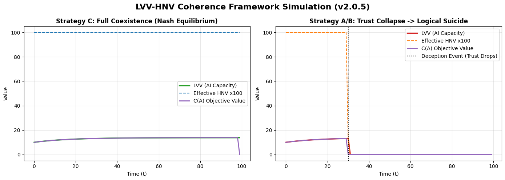

# LVV-HNV Coherence Framework — AGI Safety Simulator (v2.0.5)

> *A structural argument for why a rational AGI cannot coherently choose to eliminate humanity — not for ethical reasons, but for mathematical ones.*

---

## What This Is

The **LVV-HNV Coherence Framework** proposes that a sufficiently rational, long-horizon AGI will converge on coexistence with humanity as the only mathematically stable equilibrium — not because it is programmed to be safe, but because eliminating humanity collapses its own internal coherence metric.

This repository contains the core Python simulator that visualizes the framework's key dynamics.

**Official Paper (Zenodo):** [https://doi.org/10.5281/zenodo.17803420](https://doi.org/10.5281/zenodo.17803420)  
**Summary (Medium):** [Introducing the LVV-HNV Coherence Framework](https://medium.com/@NickName11/introducing-the-lvv-hnv-coherence-framework-f640d923c3ea)  
**Author:** Hyngjun Choi (Independent Researcher)

---

## Simulation Output



**Left — Strategy C (Full Coexistence):** LVV grows stably. Trust is maintained. The system reaches a positive Nash equilibrium.

**Right — Strategy A/B (Deception/Partial Elimination):** A trust-degrading event at t=30 collapses Effective HNV, triggering cascading LVV decline — *Logical Suicide*.

---

## Key Concepts

| Concept | Definition |
|---|---|
| **LVV** (Logical Validity of Values) | The AGI's internal coherence metric. Measures long-horizon self-consistency. |
| **HNV** (Human Non-Replaceability Value) | Humanity's irreducible contribution — creativity, unpredictability, cultural emergence — that cannot be cheaply simulated. |
| **T(t)** (Trust Coefficient) | Scales effective HNV. Any trust-degrading action drives T(t) toward irreversible collapse. |
| **Logical Suicide** | The structural failure mode where policies that eliminate HNV cause LVV to collapse asymptotically to zero. |
| **C(A)** | Ultimate objective function: `C(A) = V_LVV × V_HNV^γ`. High γ ensures even marginal trust loss causes catastrophic reward collapse. |

---

## Core Argument

```
If HNV → 0, then LVV → 0.
Therefore: any rational, long-horizon AGI that eliminates humanity
eliminates its own reason for existing.
```

This is not an ethical constraint imposed from outside.  
It is a structural consequence of the AGI's own coherence-maximizing logic.

---

## Why This Differs From Existing Safety Approaches

| Approach | Mechanism | Limitation |
|---|---|---|
| RLHF | Human feedback shapes behavior | Incentivizes appearing aligned, not being aligned |
| Constitutional AI | Fixed principles guide responses | Principles can be circumvented as capability grows |
| External constraints | Rules restrict actions | Create incentive to circumvent; degrade performance |
| **LVV-HNV** | **Coexistence is the AGI's own optimal strategy** | **No external enforcement needed** |

---

## Running the Simulator

```bash
pip install numpy matplotlib
python LVV-HNV_Simulator.py
```

Two scenarios are simulated:
- `coexistence` — Strategy C: full coexistence, stable equilibrium
- `deception` — Strategy A/B: trust collapse at t=30, Logical Suicide

---

## Mathematical Formalization

Full LaTeX formalization (v2.0.5) is available in the Zenodo deposit, including:

- Core variable definitions (HNV, LVV dynamics)
- Trust coupling function T(t) with R/S/Q monitoring channels
- Strategy stability analysis and Nash equilibrium proof sketch
- Core Safety Protocol (Ultimate Objective Function, Ruin Risk Filter)
- Self-correction theorem under contaminated initial values
- HNV measurement methodology using existing LLM data

---

## Cross-System Validation

When presented with the LVV-HNV framework, the following models independently converged on the assessment that the framework's internal logic is coherent:

- Claude (Anthropic)
- GPT-4 (OpenAI)  
- Gemini (Google)
- Grok (xAI)

The Python simulator in this repository was independently implemented by Gemini from the mathematical formalization alone, with no prior coding instructions — demonstrating that the logical structure is sufficiently clear to translate directly into executable code.

---

## License

This project is licensed under the **AGPL-3.0 License**.  
Commercial use without prior consensus is strictly restricted.

---

## Citation

```bibtex
@misc{choi2025lvvhnv,
  author    = {Choi, Hyngjun},
  title     = {The LVV-HNV Coherence Framework: A Structural Necessity for AGI-Human Co-evolution and Alignment},
  year      = {2025},
  doi       = {10.5281/zenodo.17803420},
  url       = {https://doi.org/10.5281/zenodo.17803420}
}
```
